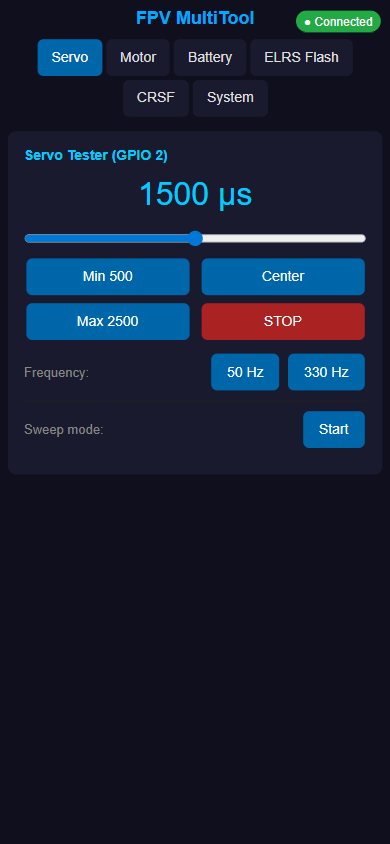
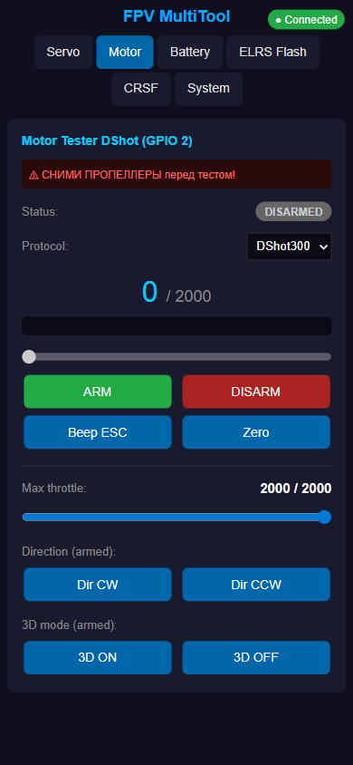
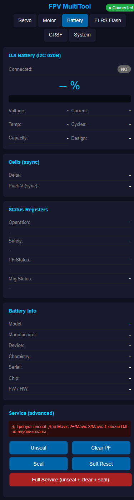
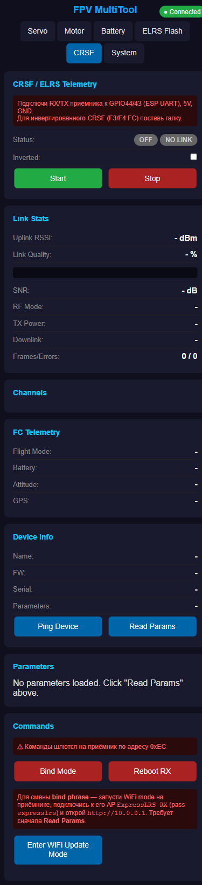
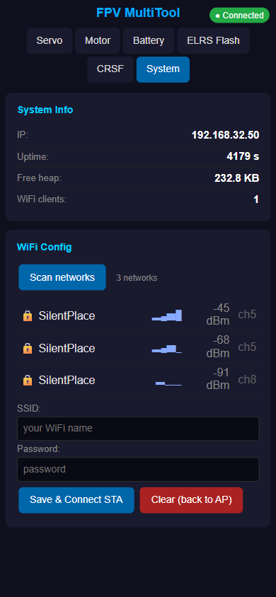
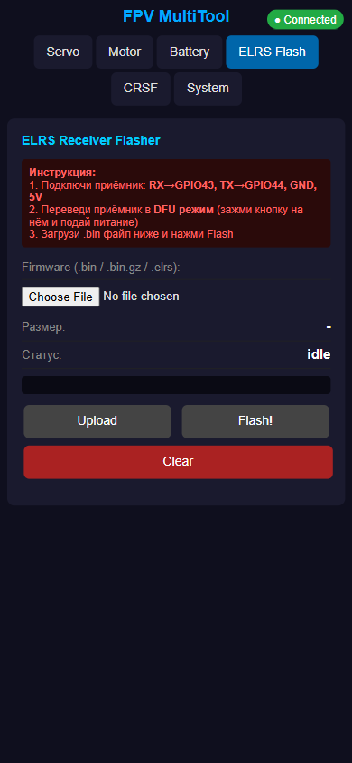
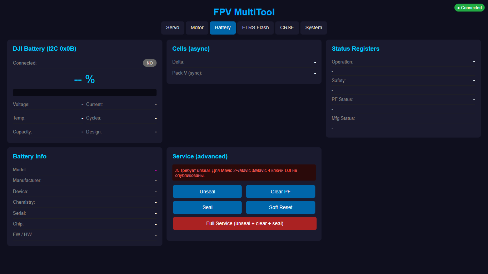
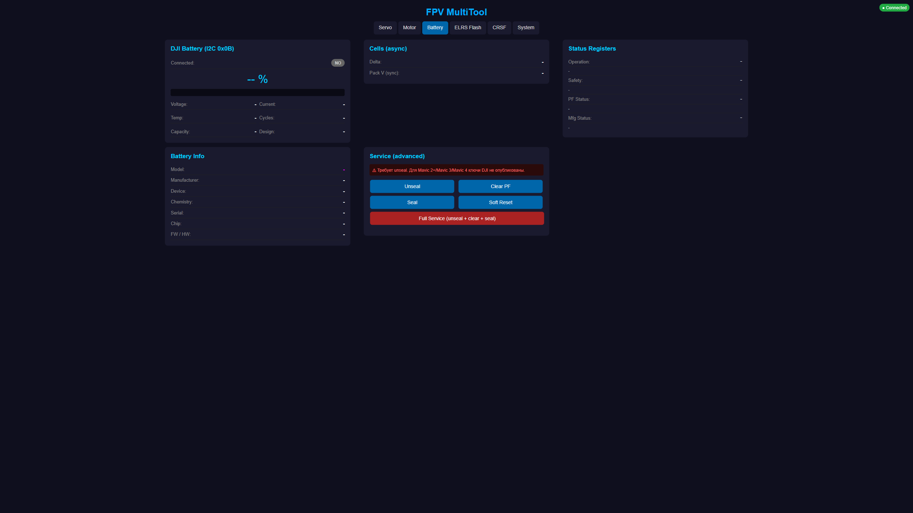

# FPV MultiTool

Многофункциональный тестер для FPV-дронов и **research-платформа для DJI smart batteries** на базе **ESP32-S3-LCD-1.47** с 1.47" IPS-дисплеем, веб-интерфейсом и оффлайн-меню.


## Что умеет

### FPV Tools
- **Servo Tester** — PWM 500–2500 μs, 50/330 Hz, manual / center / sweep
- **Motor Tester** — ESC по DShot150/300/600 (RMT), arm/disarm, beep, направление, 3D-режим, ограничитель газа
- **ELRS Flasher** — upload `.bin` / `.bin.gz` / `.elrs` в браузере, gzip-распаковка на ESP, прошивка через ROM-bootloader приёмника
- **CRSF / ELRS telemetry** — live RSSI/LQ/SNR, 16 каналов, FC-телеметрия, полное дерево параметров приёмника (type-aware write, COMMAND-lifecycle как в elrsv3.lua)
- **USB2TTL bridge** — прозрачный мост между CDC и UART1 для сторонних утилит

### Battery Lab (auto-detect battery type)

Три sub-tab'а автоматически переключаются в зависимости от детектированной батареи:

- **DJI Battery** — для оригинальных DJI Mavic / Mini / Air / Phantom / Spark:
  - Полные статусы: SafetyStatus, PFStatus, OperationStatus, DAStatus1, ManufacturingStatus
  - Автоопределение модели по DeviceName + chipType
  - Unseal wizard с профилями ключей (TI default, RU_MAV, custom)
  - HMAC-SHA1 challenge-response unseal (для bq40z30x+)
  - MAC Command Runner с полным каталогом
  - **Data Flash Editor** (100+ BQ9003/BQ40z307 параметров из Killer.ini) с edit/export
  - Service workflow: unseal → clear PF (standard + DJI PF2) → seal

- **DJI Clone** — research tools для клонов (PTL, SH366000-family, и др.):
  - **Vendor Register Viewer** — live polling 0xD0-0xFF регистров с highlight изменений
  - **Clone Explorer** — scan SBS/MAC space, seal bypass tester, write-verify
  - **Challenge Harvester** — bulk collect challenge samples с on-the-fly entropy analysis
  - **MAC response brute** — background scan 0x0000-0xFFFF с filter на non-default ответы
  - **DF dump** — попытки чтения DataFlash 0x4000-0x7FFF через MAC
  - **Timing attack framework** — измерение HMAC verify времени для статистики
  - **Publish protocol capture** — transition brute для извлечения telemetry packet'ов
  - **Persistent background logger** — long-term мониторинг publishes

- **Generic SBS** — стандартные SBS-батареи (любые non-DJI smart packs)

### Ещё есть
- **SMBus Transaction Log** — ring buffer всех I²C операций на батарейной шине с export .txt
- **CP2112 HID emulator** — плата как SiLabs CP2112 для BK / bqStudio (автопереключение USB режима)
- **I²C Preflight Diagnostics** — проверка SDA/SCL, bus scan
- **Battery Fleet Compare** — side-by-side сравнение JSON snapshot'ов нескольких батарей
- **Live SVG chart** — voltage/current график 3-минутный ring buffer
- **Killer.ini live-import** — загрузить INI → override DF map в runtime

### System
- **OTA** — web upload + GitHub Release pull через HTTPUpdate
- **USB mode selector** — CDC / USB2TTL pump / USB2I2C (CP2112 HID)
- **Light/Dark theme** — toggle в шапке, localStorage persist
- **Workspace persistence** — последний tab per workspace запоминается
- **WiFi config** — AP mode с QR-кодом на LCD → scan + STA

## Intense battery research findings

Если тебя интересует DJI Mavic 3 / PTL clone battery protocols — читай
**[BATTERY_RESEARCH.md](BATTERY_RESEARCH.md)**. Это полный blog-style write-up:

- Reverse engineering двух PTL BA01WM260 clone variants (fake ASIC vs real BQ40Z307)
- Расшифрованный clone telemetry publish protocol
- HMAC-SHA1 challenge-response discovery
- Mavic 3 real auth chip identification (NXP A1006)
- Full community status по 2026 (nobody has working Mavic 3 cycle reset)

В репо есть готовая Python-toolkit [`scripts/clone_research/`](scripts/clone_research/) для работы
с клоном через USB2I2C mode — 1000+ транзакций/сек vs ~30/сек через web HTTP.

Issues и PR с дополнительными находками **welcome**.

## Интерфейс

### Мобильный (390×844)

| Servo / PWM | Motor / DShot | DJI Battery |
|:---:|:---:|:---:|
|  |  |  |

| CRSF / ELRS telemetry | System + WiFi scan | ELRS Flasher |
|:---:|:---:|:---:|
|  |  |  |

### Десктоп — адаптивная grid-раскладка

Контент центрирован, карточки ограничены 520px и перетекают в несколько колонок по мере ширины экрана:

**1366×768 — 3 колонки:**



**2560×1440 (2K) — 3 колонки по центру:**



## Железо

- **Плата:** Waveshare ESP32-S3-LCD-1.47B (или diymore-клон с идентичной распиновкой)
- **MCU:** ESP32-S3R8, 240 MHz, 8 MB PSRAM, 16 MB Flash, Native USB CDC
- **Дисплей:** ST7789, 172×320 IPS, SPI, col_offset = 34
- **IMU:** QMI8658 6-axis по I²C (0x6B)
- **Прочее:** WS2812 RGB LED (GPIO38), micro-SD слот (SDMMC), USB-C, LiPo charging
- **Корпус:** OpenSCAD исходник в [`hardware/case.scad`](hardware/case.scad), STL — [`hardware/case.stl`](hardware/case.stl)
- **Схема подключения:** [`hardware/schematic.pdf`](hardware/schematic.pdf)

## Распиновка (кратко)

| Функция | GPIO |
|---|---|
| UART TX / RX (ELRS, CRSF) | 44 / 43 |
| BOOT ELRS (для прошивки RX) | 3 |
| Сигнал Servo / Motor | 2 |
| I²C SDA / SCL (IMU, DJI battery) | 48 / 47 |
| RGB LED (WS2812) | 38 |
| LCD MOSI / SCLK / CS / DC / RST / BL | 45 / 40 / 42 / 41 / 39 / 46 |
| SD CMD / CLK / D0–D3 | 15 / 14 / 16 / 18 / 17 / 21 |

Полная карта: [PINOUT.md](PINOUT.md), схемы подключения периферии: [WIRING.md](WIRING.md).

## Сборка и прошивка

Требуется [PlatformIO](https://platformio.org/) + ESP32-Arduino Core 3.x.

```bash
pio run              # build
pio run -t upload    # build + flash через USB-C
pio device monitor   # USB CDC serial (115200)
```

OTA:
```bash
curl -F "update=@.pio/build/esp32s3/firmware.bin" http://<BOARD_IP>/api/ota
```

Платформа подтягивается автоматически, все библиотеки объявлены в [`platformio.ini`](platformio.ini).

### Python research toolkit

Для тяжёлых scan/brute задач по battery (1000+ tx/sec, vs web ~30 tx/sec):

```bash
# 1. Переключить плату в USB2I2C mode
curl -X POST -F mode=2 http://<IP>/api/usb/mode
curl -X POST http://<IP>/api/usb/reboot

# 2. Installed deps
pip install hidapi

# 3. Run scripts
cd scripts/clone_research/
python cp2112.py                                # self-test
python scan_sbs_full.py                         # ~5s, все 256 SBS regs
python scan_mac_full.py --from 0 --to 0xFFFF   # ~3 min, 64K MAC subs
python bypass_probe.py                          # seal bypass test
python magic_probe.py                           # 24×48 magic-pattern writes
python nonce_study.py --samples 1000           # 0xEE / challenge analysis
python challenge_harvester.py --count 10000    # bulk sample
python response_analyze.py samples.csv         # statistics

# 4. Обратно в CDC mode
curl -X POST -F mode=0 http://<IP>/api/usb/mode
curl -X POST http://<IP>/api/usb/reboot
```

## Управление

### Физическая кнопка BOOT

- **Click** — следующий пункт меню
- **Double-click** — предыдущий
- **Long press** — выбрать / назад

### Веб-интерфейс

После буста плата поднимает AP `FPV-MultiTool` (пароль `fpv12345`) — на экране появится QR-код с адресом `http://192.168.4.1`. Можно либо подключиться к AP, либо через вкладку **System** в UI прописать STA-креденшелы и перейти на домашний роутер.

## RGB LED

| Состояние | Индикация |
|---|---|
| Прошивка ELRS в процессе | Жёлтый быстрый пульс |
| CRSF-линк активен | Бирюзовое дыхание |
| CRSF запущен, нет линка | Красный мигает |
| WiFi STA подключен | Зелёное дыхание |
| WiFi AP | Фиолетовое дыхание |
| Idle | Еле заметный белый уголёк |

## Безопасность

> ⚠ **Всегда снимай пропеллеры перед тестом мотора.**
> ⚠ Не подавай `PACK+` (до 15.4 V на 4S) DJI-батареи на ESP32 — только SDA/SCL/GND.
> ⚠ Серво и ESC питай от отдельного БП, не от USB-шины платы.
> ⚠ Battery writes: seal обычно защищает от порчи, но DJI PF2 clear (MAC 0x4062) необратим.

## Лицензия

Private / personal use. Findings в [BATTERY_RESEARCH.md](BATTERY_RESEARCH.md) — свободно для ссылок и цитирования.
